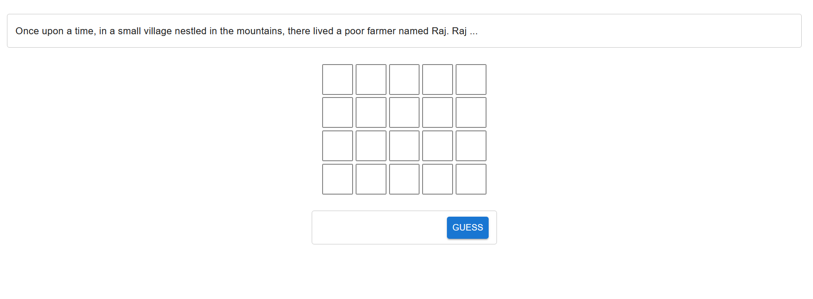
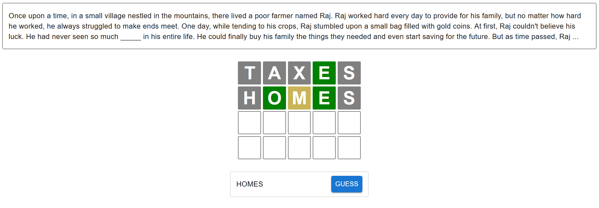
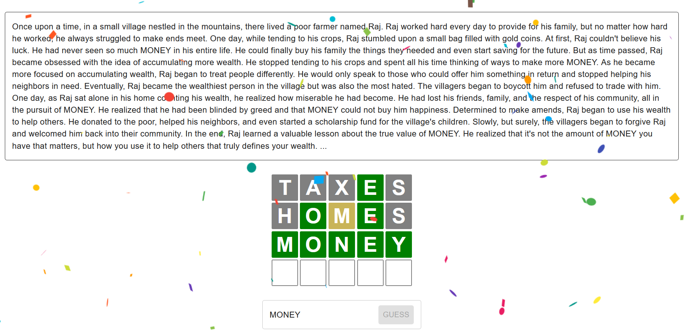
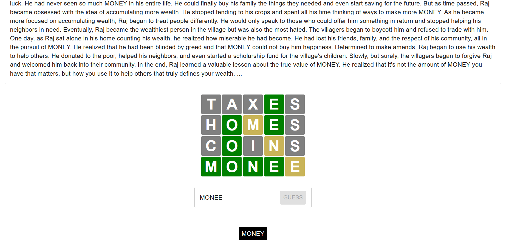

# CHATGPT wordle

Prototype for feasibility.

# How to play

ChatGPT has been told to make a story about a particular 5 letter word.
The wordle challenge is to find the word, while more and more of the story is revealed.
You have fewer guesses than normal Wordle because of the decreased difficulty.

# Find personal access token

Go to your terminal and do `git remote -v`

# Windows venv stuff

`cd venv/Scripts ; .\activate ; cd ../..`
`cd venv/Scripts ; deactivate ; cd ../..`

# Linux venv stuff

User Guide: https://setuptools.pypa.io/en/latest/userguide/quickstart.html

Key steps are to:
1. Setup the virtual env via `virtualenv venv`
2. Activate the virtual env `source venv/bin/activate`
3. Install the build script - `pip3 install --upgrade build`
4. Install the dependencies - `python3 setup.py install`
5. Start the server via `python3 chatgptwordle/manage.py runserver`
6. Check 'http://localhost:8000/api/responses/' if the API is working
7. Load data from `data/money.json` (can use POST via above endpoint)

# Links

1. Github link: https://github.com/masonator24601/chatgpt-wordle-prototype
2. Original wordle: https://www.nytimes.com/games/wordle/index.html
3. React App Docs: https://create-react-app.dev/docs/getting-started/

# Screenshots

The game has been loaded.

As more guesses are made, more of the story is revealed. 
The word to guess is blanked out in the story.

Here is the full story revealed after guessing the word and winning the game.

If you don't guess correctly within 4 tries, you lose, with the answer being given.

